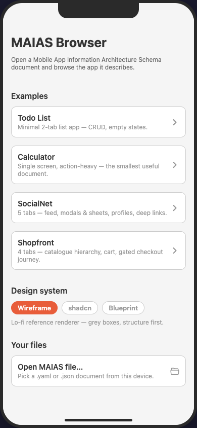

# MAIAS Browser

An Expo app that opens any [MAIAS document](../docs/spec/README.md) at runtime and renders the app it describes: dynamic tab bar, every screen with its elements and navigation, states, and data dependencies. Nothing app-specific is hard-coded — the whole shell is derived from the loaded document, so opening a different document re-derives the entire app. Validation runs on load via [`@maias/core`](../packages/core/README.md); a broken document renders as an in-app diagnostics list, never a crash.

## Run

From the repo root:

```sh
npm install && npm run build -w @maias/core   # core must build before the app

npm run web --workspace maias-browser         # web
npm run ios --workspace maias-browser         # iOS simulator
npm run android --workspace maias-browser     # Android emulator
```

The app opens at a document menu: pick a bundled example (`examples/`) or load your own `.yaml`/`.json` file with the file picker.



## Rendering

Screens render as wireframes by default, with pluggable design-system adapters (wireframe · shadcn-style · blueprint) — see [docs/adapters.md](../docs/adapters.md) for the adapter interface. A Quick Nav overlay gives searchable jump-to-any-screen; on web the app renders inside a simulated iPhone frame with a desktop toggle.

## Web deployment

`npx expo export --platform web` in this directory produces `dist/`, a static single-page app deployable on any static host — details in [ARCHITECTURE.md](ARCHITECTURE.md#web-deployment).

## How it works

[ARCHITECTURE.md](ARCHITECTURE.md) — the as-built architecture: document loading, the `IaRuntime`, the 3-file routing structure, component registry, and styling. The target architecture for the wider project is [docs/ARCHITECTURE.md](../docs/ARCHITECTURE.md).
