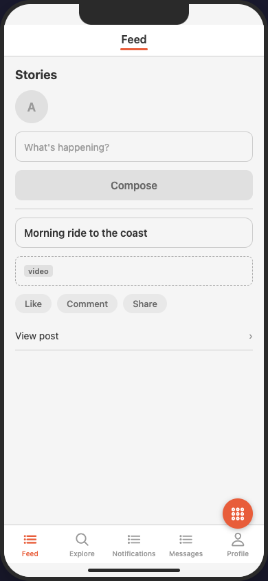

# MAIAS example documents

Four documents that collectively exercise the whole core spec (R4). Each folder holds one `maias.yaml` plus a README noting what it demonstrates. All pass `maias validate` and are canonical under `maias fmt`; all are bundled in the MAIAS Browser's example menu.

| Example | Size | Tabs | Demonstrates |
|---|---|---|---|
| [calculator](calculator/) | 1 screen | 1 (bar hidden) | Minimal document, action-heavy screen, `chips`, custom `x_` element |
| [todo_list](todo_list/) | 5 screens | 2 | List CRUD, empty/error states, `:id` params, deep link, auth, `x_` fields |
| [social_network](social_network/) | 12 screens | 5 | Modals & sheets, `replace`, params, deep links, states, `video`, `segmented_control` |
| [ecommerce](ecommerce/) | 14 screens | 4 | Catalogue hierarchy (nested params), checkout journey with `replace` exit, store-finder `map`, sort `action_sheet`, one-tap `action`, gated screens, external action |

Entry screens as rendered by the [MAIAS Browser](../MAIAS_browser/)'s wireframe adapter (each example README has more screens):

| [calculator](calculator/) | [todo_list](todo_list/) | [social_network](social_network/) | [ecommerce](ecommerce/) |
|---|---|---|---|
|  |  |  |  |

## Spec-feature coverage (R4.2)

| Spec construct (R1.1) | Covered by |
|---|---|
| (a) `maias` version header | all |
| (b) screens & screen types | all (all 12 core screen types appear across the set) |
| (c) flows | all; multi-flow: social_network (5), ecommerce (3) |
| (d) navigation primary/secondary/actions | all; external action: ecommerce (Share product) |
| (d′) declared `back` (spec 0.2) | all except calculator (single screen) |
| (e) presentation modes | `modal`: social_network, ecommerce · `sheet`: social_network, ecommerce · `replace`: social_network, ecommerce · `push`: default everywhere |
| (f) route paths & parameters | todo_list (`/tasks/:id`), social_network (`:username`), ecommerce (nested `/:category_id/products/:product_id`) |
| (g) element taxonomy | all 29 core types appear across the set (incl. `video`, `radio_group`, `slider`, `map`, `bullets`) |
| (h) app chrome / tab bar derivation | 1-tab hidden bar (calculator), 2 (todo_list), 4 (ecommerce), 5 (social_network) |
| (i) screen states | todo_list, social_network (empty/loading/error), ecommerce |
| (j) data reads/writes | all |
| (k) deep links | todo_list, social_network, ecommerce |
| (l) auth gating | todo_list, social_network, ecommerce |
| (m) extension mechanism | calculator (`x_calc_history_tape`), todo_list (`x_todo_confetti`, `x_owner_team`), ecommerce (`x_shop_reviews_carousel`) |
