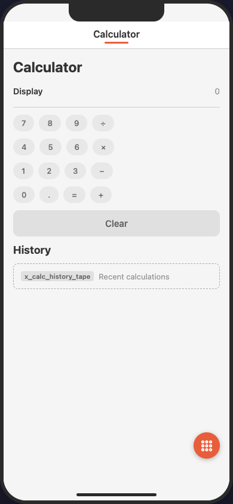
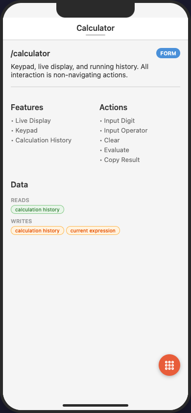

# calculator

The smallest useful MAIAS document: one screen, one flow, one primary entry.

| `calculator` — UI view | data view |
|---|---|
|  |  |

*Rendered by the [MAIAS Browser](../../MAIAS_browser/) (wireframe adapter). With a single primary screen the tab bar is hidden; the keypad `chips` and the `x_calc_history_tape` fallback are visible. Tapping the screen title flips to the data view — the screen's IA metadata: type, features, actions, and `data` reads/writes.*

Demonstrates:
- **Single-screen app** — `primary.screens` has one entry, so renderers hide the tab bar (spec §6.1)
- **Action-heavy screen** — interaction lives in `actions:` (non-navigating), not navigation
- **`chips` structured labels** — the keypad rows use `|`-separated labels
- **Custom element type** — `x_calc_history_tape` renders via the fallback guarantee (spec §10.1)
- **Data reads/writes** — same key (`calculation_history`) both read and written
