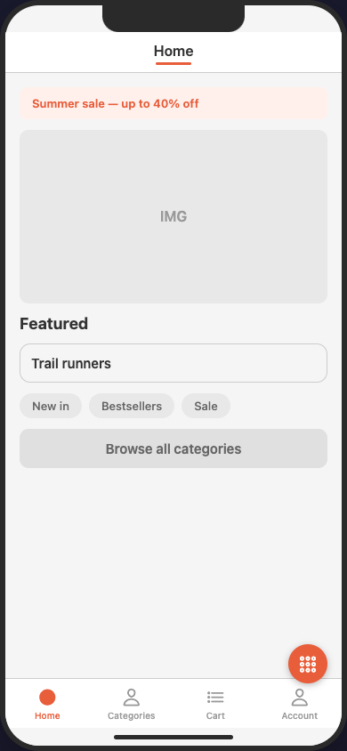
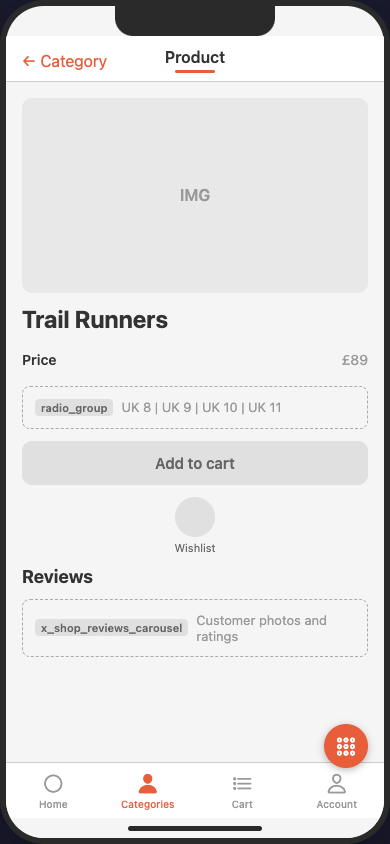
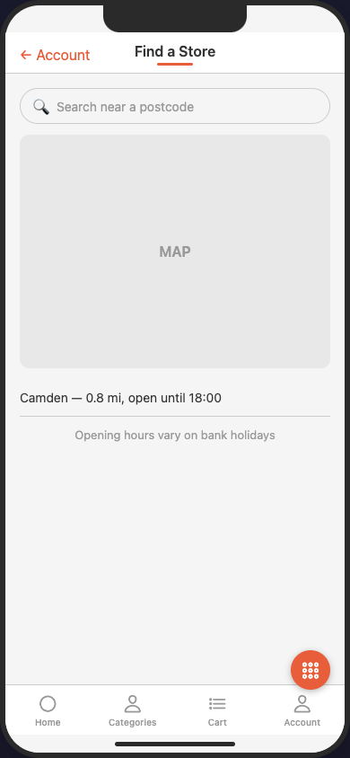
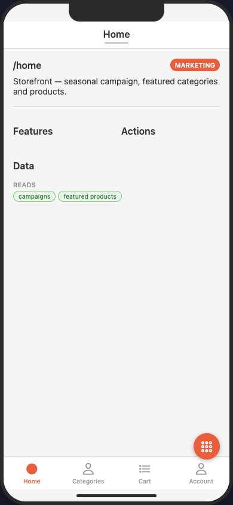
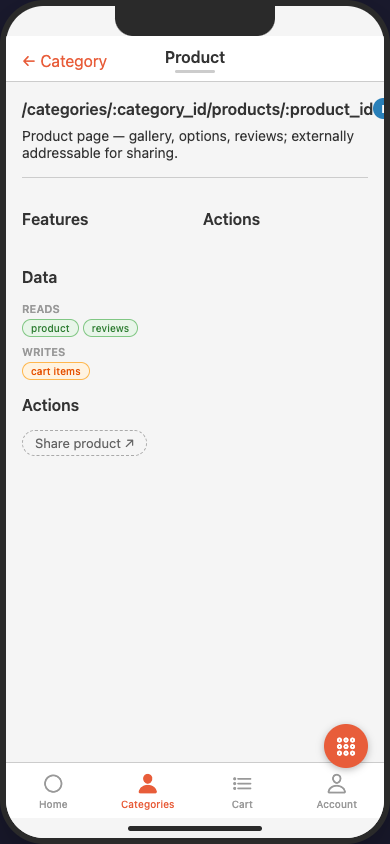
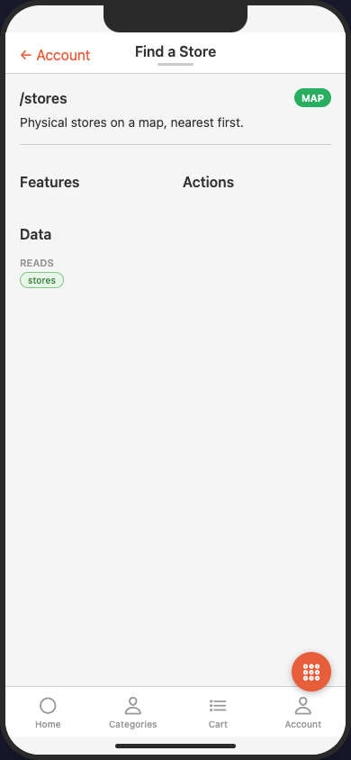

# ecommerce

A four-tab shop — catalogue hierarchy and a gated linear checkout journey.

| `home` (entry) | `product` (nested params) | `store_finder` (`map`) |
|---|---|---|
|  |  |  |
|  |  |  |

*Rendered by the [MAIAS Browser](../../MAIAS_browser/) (wireframe adapter): the 4-tab shell, a product at `/categories/:category_id/products/:product_id` with `radio_group` and the `x_shop_reviews_carousel` fallback, and the store-finder `map`. The second row is each screen's data view (tap the screen title to toggle) — the IA metadata: type, path, features, actions (including the external "Share product"), and `data` reads/writes.*

Demonstrates:
- **Catalogue hierarchy with nested parameters** — `/categories/:category_id/products/:product_id`
- **A journey with an exit transition** — cart → address → shipping → payment → `order_confirmation` (`presentation: replace`, so back cannot re-enter payment); "Continue shopping" also replaces
- **Input elements** — `slider` (price filter), `radio_group` (sizes, shipping speed), `dropdown`, `checkbox`, `progress` as a checkout stepper
- **Auth gating on part of a journey** — browsing and cart are open; every checkout step and the account area are `auth: required`
- **External action** — "Share product" leaves the app (`external: true`)
- **Custom element type** — `x_shop_reviews_carousel` via the fallback guarantee
- **Screen states** — empty cart with recovery CTA, empty filter results, loading listing
- **The three interaction-screen types** — `action_sheet` (sort options as a bottom sheet), `action` (one-tap reorder as a modal), `map` (store finder with `map`, `caption` elements)
