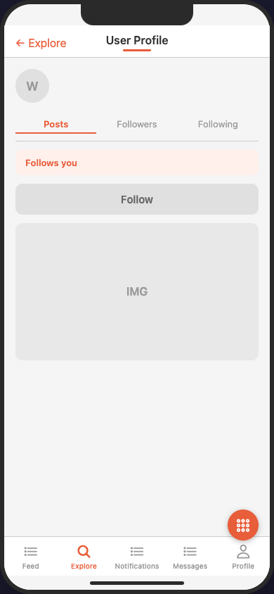
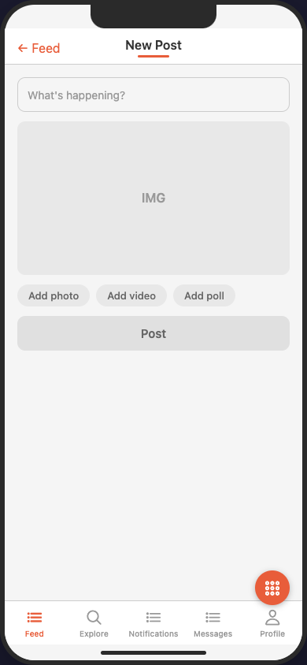
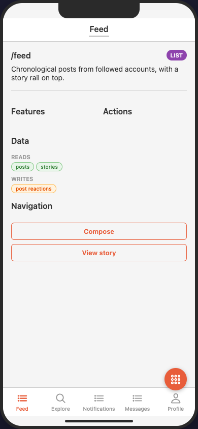
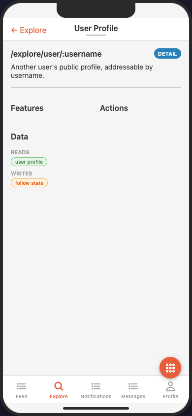
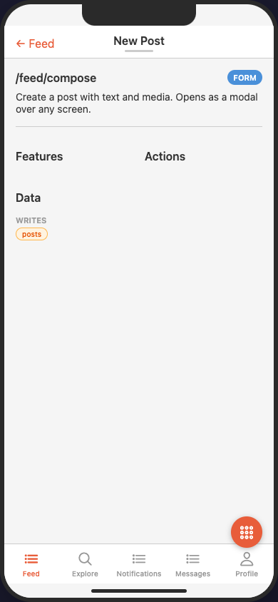

# social_network

A five-tab social app — the busiest navigation surface in the example set.

| `feed` (entry) | `user_profile` (`/explore/user/:username`) | `compose_post` (modal) |
|---|---|---|
|  |  |  |
|  |  |  |

*Rendered by the [MAIAS Browser](../../MAIAS_browser/) (wireframe adapter): the 5-tab shell, the feed's `video` element, and a parameterised deep-linked profile. The second row is each screen's data view (tap the screen title to toggle) — the IA metadata: type, path, features, actions, `data` reads/writes, and navigation links.*

Demonstrates:
- **5-tab dynamic shell** — the browser derives tab count/order from `navigation.primary`
- **Modals and sheets** — `compose_post` (`presentation: modal`), `story_viewer` (`sheet`)
- **`replace` transitions** — posting returns to the feed without back-history; saving a profile edit likewise
- **Parameterised, deep-linked screens** — `/feed/post/:post_id`, `/explore/user/:username`, `/messages/:conversation_id`
- **Screen states** — feed declares `empty` / `loading` / `error` with full replacement element lists
- **Media elements** — `video` in the feed, `image` grids, `avatar`, `segmented_control`, `progress`
- **Auth gating** — creation and private surfaces (`compose_post`, `messages`, `profile`, …) are `auth: required`; browse surfaces are open
