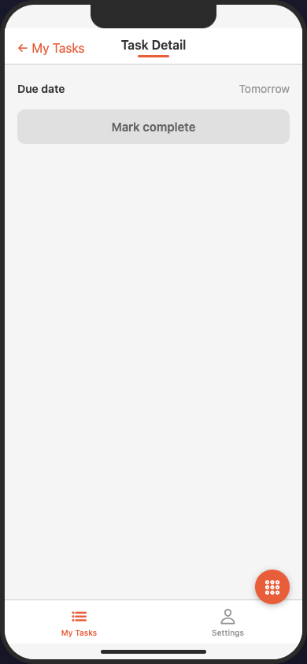
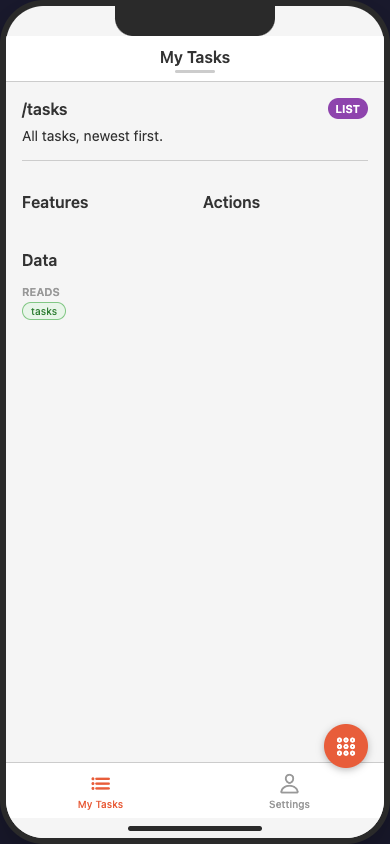
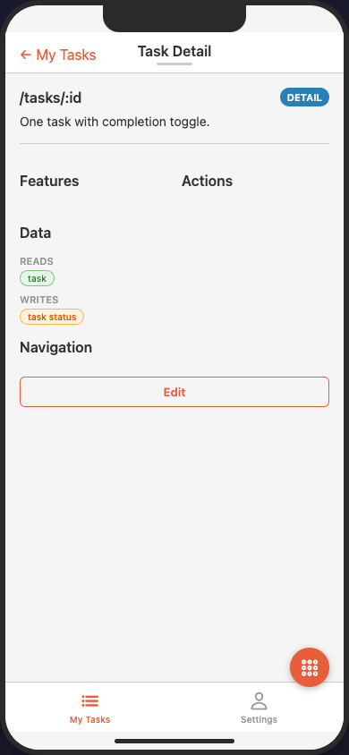

# todo_list

A minimal 2-tab list app; also the core library's primary test fixture.

| `home` (`/tasks`) | `task_detail` (`/tasks/:id`) | `task_new` (modal form) |
|---|---|---|
|  |  |  |
|  |  |  |

*Rendered by the [MAIAS Browser](../../MAIAS_browser/) (wireframe adapter): the 2-tab bar, the list → parameterised detail → form journey, and the `x_todo_confetti` fallback element on the list screen. The second row is each screen's data view (tap the screen title to toggle) — the IA metadata: type, path, features, actions, and `data` reads/writes.*

Demonstrates:
- **List CRUD shape** — list screen → parameterised detail (`/tasks/:id`) → modal form
- **Screen states** — `empty` (with a call-to-action element list), `loading`, `error` (spec ch. 7)
- **Presentation modes** — `task_new` declares `presentation: modal`; a link overrides with `modal` too
- **Deep link** — `task_detail` is addressable at `todo://tasks/:id`
- **Auth gating** — `settings` requires auth
- **Extension fields** — `x_owner_team` on a screen; `x_todo_confetti` custom element via fallback
